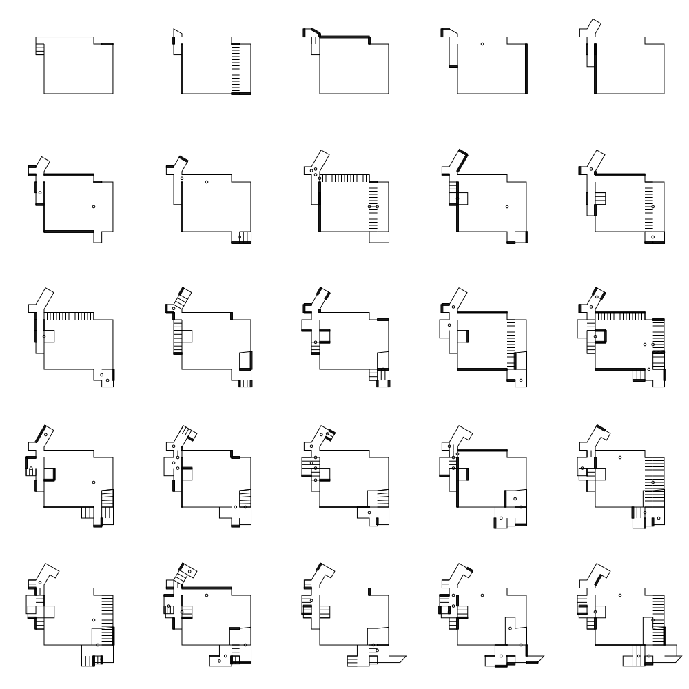
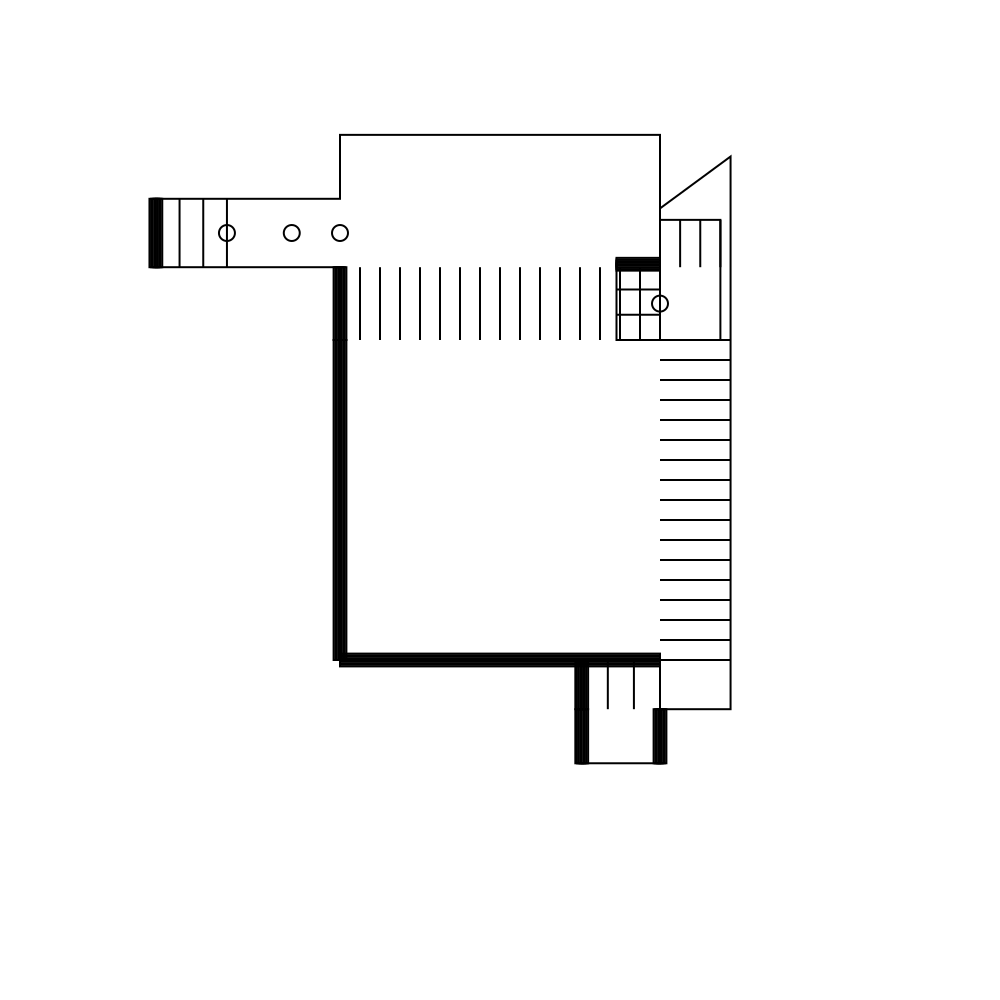
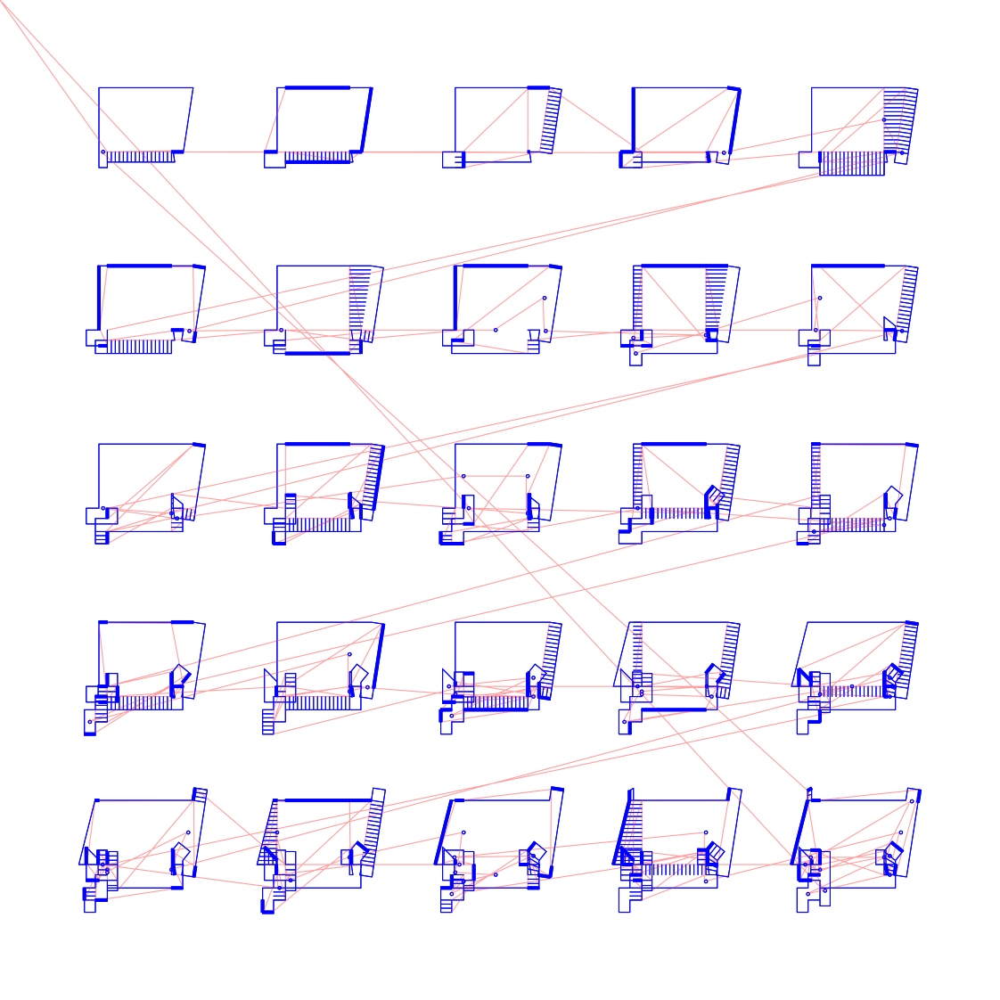

# Architecture

Implementation of [Impossible Architecture](https://inconvergent.net/2018/impossible-architecture/) from [Anders Hoff](https://inconvergent.net/#about) in python for plotting with a pen plotter.

Examples:

Plotting with a pen plotter:

